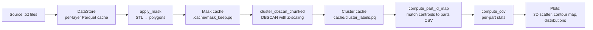

# ampm-analyzer

Analysis pipeline for Renishaw 500S PBF-LB AMPM (post-process monitoring) data.

Each Renishaw 500S build produces hundreds of layers, each containing ~250,000 monitoring rows recording per-pulse melt-pool intensity, plasma signal, laser back-reflection, and laser power along with the demanded XY position. A full build is ~80M rows. This package loads that data, masks it to the printed parts, clusters the points back into individual physical parts, links each cluster to the part metadata exported from QuantAM, and produces a coefficient-of-variation analysis plus interactive 3D and parametric plots.

## Quickstart

```bash
# Install (from the project root)
pip install -e .

# Edit config.py at the project root with paths to your build
# (the SOURCE directory containing 'Packet data for layer N, laser 4.txt' files,
# the STL of the parts, and the QuantAM parts CSV)

# Run the example coefficient-of-variation analysis
python examples/cov.py

# Or open the per-layer interactive viewer
python examples/view_layers.py
```

The first run takes several minutes — the script converts every source `.txt` file to a per-layer Parquet cache, computes the STL-based mask, and runs DBSCAN. Subsequent runs are seconds because everything is cached on disk.

See the [Installation](#installation) section below for more options.

## Pipeline overview



Each stage is independent and cacheable. If you change clustering parameters but not the mask, only the cluster cache invalidates.

See [docs/PIPELINE.md](docs/PIPELINE.md) for the full step-by-step.

## Project layout

```
ampm-analyzer/
├── ampm/                       # The package
│   ├── datastore.py            # Source → per-layer Parquet cache
│   ├── masking.py              # STL → per-layer 2D polygon masks
│   ├── mask_cache.py           # Persistence for the masked-rows result
│   ├── clustering.py           # DBSCAN (sampled + chunked variants)
│   ├── cluster_cache.py        # Persistence for cluster labels
│   ├── parts.py                # QuantAM CSV parser + cluster→part-ID
│   ├── stats.py                # Coefficient of variation
│   ├── correction.py           # XY-bias correction polynomial
│   ├── plotting.py             # All Plotly figure builders
│   └── sampling.py             # Random / stride / grid downsamplers
├── config.py                   # Paths and physical parameters
├── examples/                   # Runnable example scripts
│   ├── cov.py                  # CoV analysis with DBSCAN clustering
│   ├── cov_direct.py           # CoV analysis with direct nearest-part assignment
│   ├── view_layers.py          # Per-layer interactive viewer
│   └── tune_eps.py             # DBSCAN tuning workflow
├── tests/                      # 173 tests across 11 phases
├── pyproject.toml              # Project metadata, dependencies, pytest config
└── docs/                       # Detailed chapter docs
    ├── PIPELINE.md             # End-to-end flow
    ├── CLUSTERING.md           # DBSCAN tuning + memory
    ├── CACHING.md              # Cache files + invalidation
    ├── PARTS.md                # QuantAM CSV + part assignment
    ├── PLOTTING.md             # Plot functions + file size
    └── CORRECTION.md           # XY-bias correction
```

## Where to next?

- **Just want to run something** → edit `config.py` paths, run `python examples/cov.py`
- **Build has few, large, well-separated parts** (typical medical implants) → `python examples/cov_direct.py` is simpler and doesn't need clustering tuning
- **Tuning DBSCAN for a new build** → run `python examples/tune_eps.py`, also see [docs/CLUSTERING.md](docs/CLUSTERING.md)
- **Cache misbehaving / want to clear it** → [docs/CACHING.md](docs/CACHING.md)
- **A part isn't being identified correctly** → [docs/PARTS.md](docs/PARTS.md)
- **Want to add a new plot** → [docs/PLOTTING.md](docs/PLOTTING.md)
- **Different machine or sensor than the MAIN MeltVIEW** → [docs/CORRECTION.md](docs/CORRECTION.md)

## Installation

The package is installable in editable mode from the project root:

```bash
pip install -e .
```

That installs `ampm` plus all required dependencies (polars, plotly, scikit-learn, scipy, trimesh, shapely, etc.). Editable mode means edits to the source tree are picked up immediately — useful while developing.

Requires Python 3.11 or newer.

To also install the test framework:

```bash
pip install -e ".[dev]"
```

## Running tests

```bash
pytest                          # All 173 tests, ~25 seconds
pytest tests/test_phase8.py     # Just the parts module tests
python tests/test_phase11.py    # Direct invocation also works
```

(Requires `pip install -e ".[dev]"` to get pytest itself.)

## Limitations

- The default polynomial in `correction.py` is calibrated for the **MAIN machine's MeltVIEW melt pool (mean) signal only**. Pass your own `power_matrix` and `coefficients` for other sensors or machines (RBV, etc.).
- DBSCAN tuning is build-dependent. The defaults in `cov.py` are validated for the JR299 Sterling parametric build (20 parts, 5 mm minimum spacing). For different geometries you may need to retune `EPS_XY` — see [docs/CLUSTERING.md](docs/CLUSTERING.md).
- Windows paths containing `[` or `]` characters require explicit handling because Polars treats them as glob metacharacters. The package handles this everywhere internally; just be aware if you're writing new code that touches Parquet paths.
